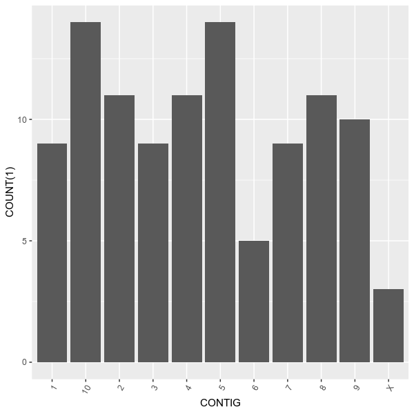
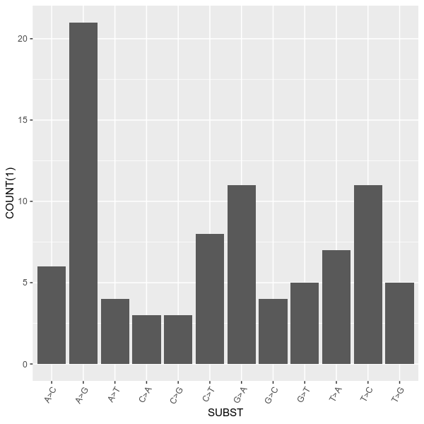
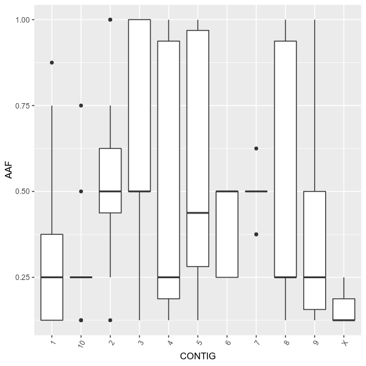
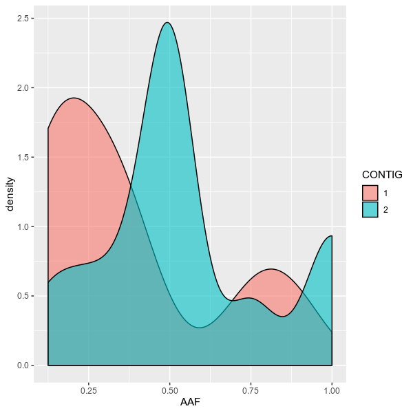
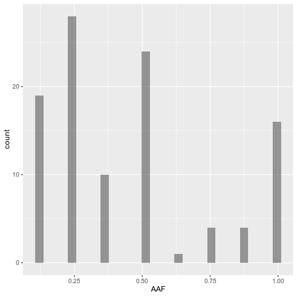
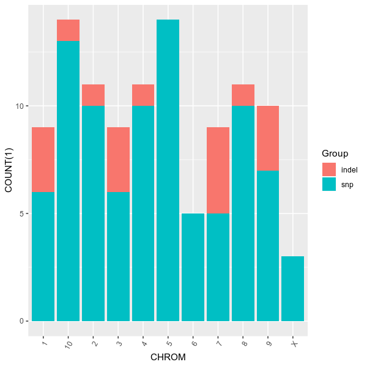
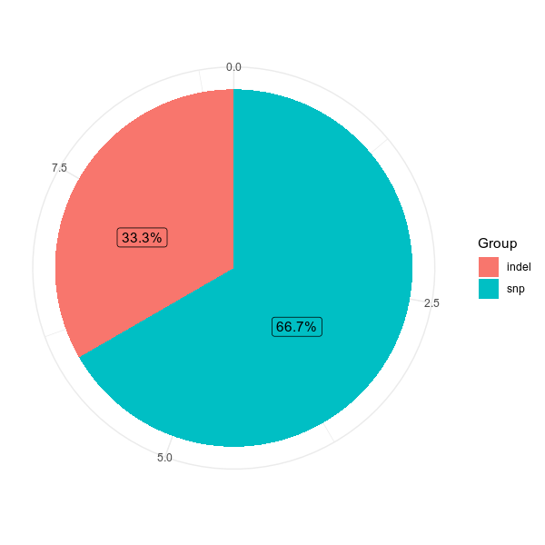
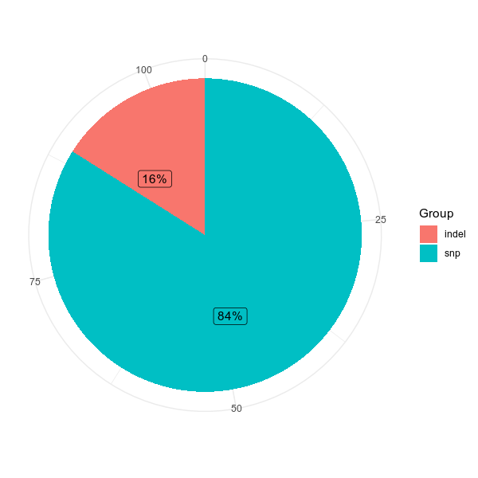
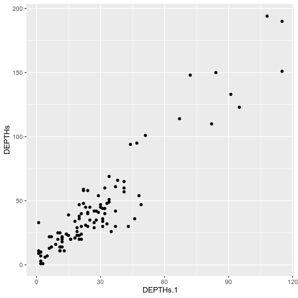

# vcfstats

Powerful statistics for VCF files

[Documentation][1]

## Installation
`vcfstats` also requires R with ggplot2 to be installed.
If you are doing `pie` chart, `ggrepel` is also required.
```shell
pip install vcfstats
```

## Gallery

### Number of variants on each chromosome

```shell
vcfstats --vcf examples/sample.vcf \
	--outdir examples/ \
	--formula 'COUNT(1) ~ CONTIG' \
	--title 'Number of variants on each chromosome' \
	--config examples/config.toml
```



#### Changing labels and ticks

```shell
vcfstats --vcf examples/sample.vcf \
	--outdir examples/ \
	--formula 'COUNT(1) ~ CONTIG' \
	--title 'Number of variants on each chromosome (modified)' \
	--config examples/config.toml \
	--ggs 'scale_x_discrete(name ="Chromosome", \
		limits=c("1","2","3","4","5","6","7","8","9","10","X")) + \
		ylab("# Variants")'
```

.col.png)

#### Number of variants on first 5 chromosome

```shell
vcfstats --vcf examples/sample.vcf \
	--outdir examples/ \
	--formula 'COUNT(1) ~ CONTIG[1,2,3,4,5]' \
	--title 'Number of variants on each chromosome (first 5)' \
	--config examples/config.toml
# or
vcfstats --vcf examples/sample.vcf \
	--outdir examples/ \
	--formula 'COUNT(1) ~ CONTIG[1-5]' \
	--title 'Number of variants on each chromosome (first 5)' \
	--config examples/config.toml
# or
# require vcf file to be tabix-indexed.
vcfstats --vcf examples/sample.vcf \
	--outdir examples/ \
	--formula 'COUNT(1) ~ CONTIG' \
	--title 'Number of variants on each chromosome (first 5)' \
	--config examples/config.toml -r 1 2 3 4 5
```

.col.png)

### Number of substitutions of SNPs
```shell
vcfstats --vcf examples/sample.vcf \
	--outdir examples/ \
	--formula 'COUNT(1, VARTYPE[snp]) ~ SUBST[A>T,A>G,A>C,T>A,T>G,T>C,G>A,G>T,G>C,C>A,C>T,C>G]' \
	--title 'Number of substitutions of SNPs' \
	--config examples/config.toml
```


#### Only with SNPs PASS all filters

```shell
vcfstats --vcf examples/sample.vcf \
	--outdir examples/ \
	--formula 'COUNT(1, VARTYPE[snp]) ~ SUBST[A>T,A>G,A>C,T>A,T>G,T>C,G>A,G>T,G>C,C>A,C>T,C>G]' \
	--title 'Number of substitutions of SNPs (passed)' \
	--config examples/config.toml \
	--passed
```

.col.png)

### Alternative allele frequency on each chromosome
```shell
# using a dark theme
vcfstats --vcf examples/sample.vcf \
	--outdir examples/ \
	--formula 'AAF ~ CONTIG' \
	--title 'Allele frequency on each chromosome' \
	--config examples/config.toml --ggs 'theme_dark()'
```


#### Using boxplot
```shell
vcfstats --vcf examples/sample.vcf \
	--outdir examples/ \
	--formula 'AAF ~ CONTIG' \
	--title 'Allele frequency on each chromosome (boxplot)' \
	--config examples/config.toml \
	--figtype boxplot
```



#### Using density plot/histogram to investigate the distribution:
You can plot the distribution, using density plot or histogram
```shell
vcfstats --vcf examples/sample.vcf \
	--outdir examples/ \
	--formula 'AAF ~ CONTIG[1,2]' \
	--title 'Allele frequency on chromosome 1,2' \
	--config examples/config.toml \
	--figtype density
```


### Overall distribution of allele frequency
```shell
vcfstats --vcf examples/sample.vcf \
	--outdir examples/ \
	--formula 'AAF ~ 1' \
	--title 'Overall allele frequency distribution' \
	--config examples/config.toml
```


#### Excluding some low/high frequency variants
```shell
vcfstats --vcf examples/sample.vcf \
	--outdir examples/ \
	--formula 'AAF[0.05, 0.95] ~ 1' \
	--title 'Overall allele frequency distribution (0.05-0.95)' \
	--config examples/config.toml
```
.histogram.png)

### Counting types of variants on each chromosome
```shell
vcfstats --vcf examples/sample.vcf \
	--outdir examples/ \
	--formula 'COUNT(1, group=VARTYPE) ~ CHROM' \
	--title 'Types of variants on each chromosome' \
	--config examples/config.toml
```



#### Using pie chart if there is only one chromosome
```shell
vcfstats --vcf examples/sample.vcf \
	--outdir examples/ \
	--formula 'COUNT(1, group=VARTYPE) ~ CHROM[1]' \
	--title 'Types of variants on each chromosome 1' \
	--config examples/config.toml \
	--figtype pie
```


#### Counting variant types on whole genome
```shell
vcfstats --vcf examples/sample.vcf \
	--outdir examples/ \
	--formula 'COUNT(1, group=VARTYPE) ~ 1' \
	--title 'Types of variants on whole genome' \
	--config examples/config.toml
```


### Counting type of mutant genotypes (HET, HOM_ALT) for sample 1 on each chromosome
```shell
vcfstats --vcf examples/sample.vcf \
	--outdir examples/ \
	--formula 'COUNT(1, group=GTTYPEs[HET,HOM_ALT]{0}) ~ CHROM' \
	--title 'Mutant genotypes on each chromosome (sample 1)' \
	--config examples/config.toml
```

.col.png)


### Exploration of mean(genotype quality) and mean(depth) on each chromosome for sample 1
```shell
vcfstats --vcf examples/sample.vcf \
	--outdir examples/ \
	--formula 'MEAN(GQs{0}) ~ MEAN(DEPTHs{0}, group=CHROM)' \
	--title 'GQ vs depth (sample 1)' \
	--config examples/config.toml
```
.scatter.png)

### Exploration of depths for sample 1,2
```shell
vcfstats --vcf examples/sample.vcf \
	--outdir examples/ \
	--formula 'DEPTH{0} ~ DEPTH{1}' \
	--title 'Depths between sample 1 and 2' \
	--config examples/config.toml
```


[1]: documentation
