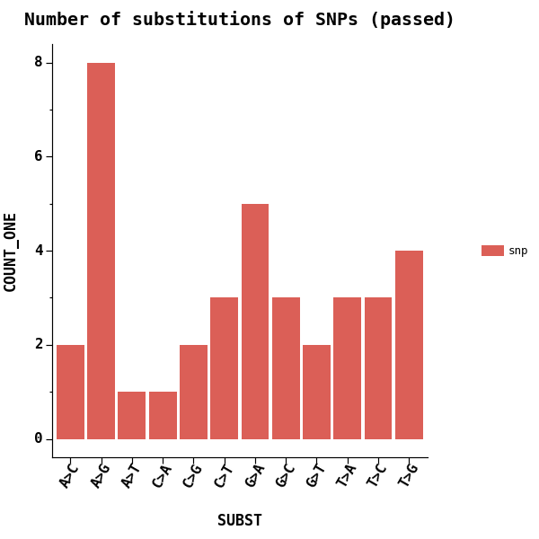
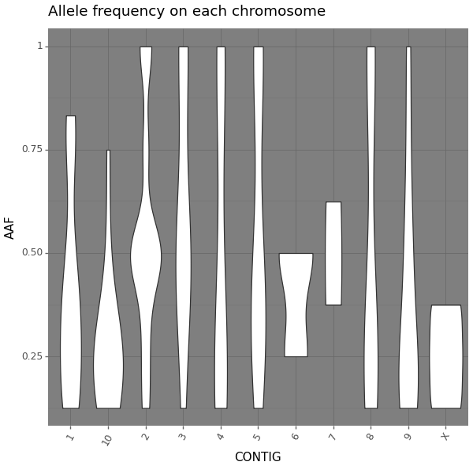
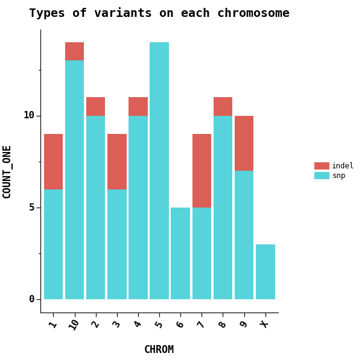
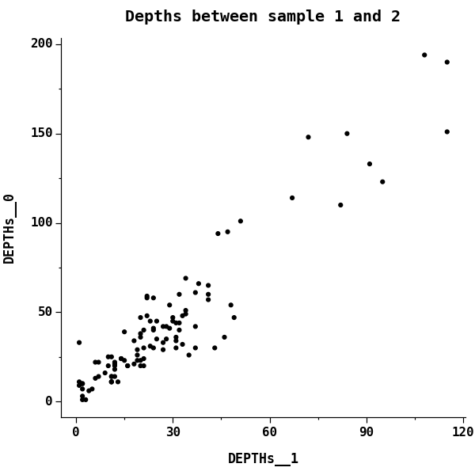

# vcfstats - powerful statistics for VCF files

[![Pypi][1]][2] [![Github][3]][4] [![PythonVers][5]][2] [![docs][6]][13] ![github action][7] [![Codacy][9]][10] [![Codacy coverage][11]][10]

[Documentation][13] | [CHANGELOG][12]

## Motivation

There are a couple of tools that can plot some statistics of VCF files, including [`bcftools`][14] and [`jvarkit`][15]. However, none of them could:

1. plot specific metrics
2. customize the plots
3. focus on variants with certain filters

R package [`vcfR`][19] can do some of the above. However, it has to load entire VCF into memory, which is not friendly to large VCF files.

## Installation

```shell
pip install -U vcfstats
```

Or run with docker:

```shell
docker run \
  -w /vcfstats/workdir \
  -v $(pwd):/vcfstats/workdir \
  --rm justold/vcfstats:latest \
  vcfstats \
  --vcf myfile.vcf \
  -o outputs \
  --formula 'COUNT(1) ~ CONTIG' \
  --title 'Number of variants on each chromosome'
```

## Gallery

### Number of variants on each chromosome

```shell
vcfstats --vcf examples/sample.vcf \
    --outdir examples/ \
    --formula 'COUNT(1) ~ CONTIG' \
    --title 'Number of variants on each chromosome' \
    --config examples/config.toml
```


#### Changing labels and ticks

`vcfstats` uses [`plotnine`][17] for plotting, read more about it on how to specify `--ggs` to modify the plots.

```shell
vcfstats --vcf examples/sample.vcf \
    --outdir examples/ \
    --formula 'COUNT(1) ~ CONTIG' \
    --title 'Number of variants on each chromosome (modified)' \
    --config examples/config.toml \
    --ggs 'scale_x_discrete(name ="Chromosome", \
        limits=["1","2","3","4","5","6","7","8","9","10","X"]); \
        ylab("# Variants")'
```


#### Number of variants on first 5 chromosome

```shell
vcfstats --vcf examples/sample.vcf \
    --outdir examples/ \
    --formula 'COUNT(1) ~ CONTIG[1,2,3,4,5]' \
    --title 'Number of variants on each chromosome (first 5)' \
    --config examples/config.toml
# or
vcfstats --vcf examples/sample.vcf \
    --outdir examples/ \
    --formula 'COUNT(1) ~ CONTIG[1-5]' \
    --title 'Number of variants on each chromosome (first 5)' \
    --config examples/config.toml
# or
# require vcf file to be tabix-indexed.
vcfstats --vcf examples/sample.vcf \
    --outdir examples/ \
    --formula 'COUNT(1) ~ CONTIG' \
    --title 'Number of variants on each chromosome (first 5)' \
    --config examples/config.toml -r 1 2 3 4 5
```


### Number of substitutions of SNPs

```shell
vcfstats --vcf examples/sample.vcf \
    --outdir examples/ \
    --formula 'COUNT(1, VARTYPE[snp]) ~ SUBST[A>T,A>G,A>C,T>A,T>G,T>C,G>A,G>T,G>C,C>A,C>T,C>G]' \
    --title 'Number of substitutions of SNPs' \
    --config examples/config.toml
```


#### Only with SNPs PASS all filters

```shell
vcfstats --vcf examples/sample.vcf \
    --outdir examples/ \
    --formula 'COUNT(1, VARTYPE[snp]) ~ SUBST[A>T,A>G,A>C,T>A,T>G,T>C,G>A,G>T,G>C,C>A,C>T,C>G]' \
    --title 'Number of substitutions of SNPs (passed)' \
    --config examples/config.toml \
    --passed
```



### Alternative allele frequency on each chromosome

```shell
# using a dark theme
vcfstats --vcf examples/sample.vcf \
    --outdir examples/ \
    --formula 'AAF ~ CONTIG' \
    --title 'Allele frequency on each chromosome' \
    --config examples/config.toml --ggs 'theme_dark()'
```



#### Using boxplot

```shell
vcfstats --vcf examples/sample.vcf \
    --outdir examples/ \
    --formula 'AAF ~ CONTIG' \
    --title 'Allele frequency on each chromosome (boxplot)' \
    --config examples/config.toml \
    --figtype boxplot
```


#### Using density plot/histogram to investigate the distribution:

You can plot the distribution, using density plot or histogram

```shell
vcfstats --vcf examples/sample.vcf \
    --outdir examples/ \
    --formula 'AAF ~ CONTIG[1,2]' \
    --title 'Allele frequency on chromosome 1,2' \
    --config examples/config.toml \
    --figtype density
```


### Overall distribution of allele frequency

```shell
vcfstats --vcf examples/sample.vcf \
    --outdir examples/ \
    --formula 'AAF ~ 1' \
    --title 'Overall allele frequency distribution' \
    --config examples/config.toml
```


#### Excluding some low/high frequency variants

```shell
vcfstats --vcf examples/sample.vcf \
    --outdir examples/ \
    --formula 'AAF[0.05, 0.95] ~ 1' \
    --title 'Overall allele frequency distribution (0.05-0.95)' \
    --config examples/config.toml
```


### Counting types of variants on each chromosome

```shell
vcfstats --vcf examples/sample.vcf \
    --outdir examples/ \
    --formula 'COUNT(1, group=VARTYPE) ~ CHROM' \
    # or simply
    # --formula 'VARTYPE ~ CHROM' \
    --title 'Types of variants on each chromosome' \
    --config examples/config.toml
```



#### Using bar chart if there is only one chromosome

```shell
vcfstats --vcf examples/sample.vcf \
    --outdir examples/ \
    --formula 'COUNT(1, group=VARTYPE) ~ CHROM[1]' \
    # or simply
    # --formula 'VARTYPE ~ CHROM[1]' \
    --title 'Types of variants on chromosome 1' \
    --config examples/config.toml \
    --figtype pie
```


#### Counting variant types on whole genome

```shell
vcfstats --vcf examples/sample.vcf \
    --outdir examples/ \
    # or simply
    # --formula 'VARTYPE ~ 1' \
    --formula 'COUNT(1, group=VARTYPE) ~ 1' \
    --title 'Types of variants on whole genome' \
    --config examples/config.toml
```


### Counting type of mutant genotypes (HET, HOM_ALT) for sample 1 on each chromosome

```shell
vcfstats --vcf examples/sample.vcf \
    --outdir examples/ \
    # or simply
    # --formula 'GTTYPEs[HET,HOM_ALT]{0} ~ CHROM' \
    --formula 'COUNT(1, group=GTTYPEs[HET,HOM_ALT]{0}) ~ CHROM' \
    --title 'Mutant genotypes on each chromosome (sample 1)' \
    --config examples/config.toml
```


### Exploration of mean(genotype quality) and mean(depth) on each chromosome for sample 1

```shell
vcfstats --vcf examples/sample.vcf \
    --outdir examples/ \
    --formula 'MEAN(GQs{0}) ~ MEAN(DEPTHs{0}, group=CHROM)' \
    --title 'GQ vs depth (sample 1)' \
    --config examples/config.toml
```


### Exploration of depths for sample 1,2

```shell
vcfstats --vcf examples/sample.vcf \
    --outdir examples/ \
    --formula 'DEPTHs{0} ~ DEPTHs{1}' \
    --title 'Depths between sample 1 and 2' \
    --config examples/config.toml
```



See more examples:

[https://github.com/pwwang/vcfstats/issues/15#issuecomment-1029367903](https://github.com/pwwang/vcfstats/issues/15#issuecomment-1029367903)

[1]: https://img.shields.io/pypi/v/vcfstats?style=flat-square
[2]: https://pypi.org/project/vcfstats/
[3]: https://img.shields.io/github/v/tag/pwwang/vcfstats?style=flat-square
[4]: https://github.com/pwwang/vcfstats
[5]: https://img.shields.io/pypi/pyversions/vcfstats?style=flat-square
[6]: https://img.shields.io/github/actions/workflow/status/pwwang/vcfstats/docs.yml?label=docs&style=flat-square
[7]: https://img.shields.io/github/actions/workflow/status/pwwang/vcfstats/build.yml?style=flat-square
[9]: https://img.shields.io/codacy/grade/c8c8bfa8c5e9443bbf268a0a7c6f206d?style=flat-square
[10]: https://app.codacy.com/gh/pwwang/vcfstats/
[11]: https://img.shields.io/codacy/coverage/c8c8bfa8c5e9443bbf268a0a7c6f206d?style=flat-square
[12]: https://pwwang.github.io/vcfstats/CHANGELOG/
[13]: https://pwwang.github.io/vcfstats/
[14]: https://samtools.github.io/bcftools/bcftools.html#stats
[15]: http://lindenb.github.io/jvarkit/VcfStatsJfx.html
[17]: https://plotnine.readthedocs.io/en/stable/
[19]: https://knausb.github.io/vcfR_documentation/visualization_1.html
